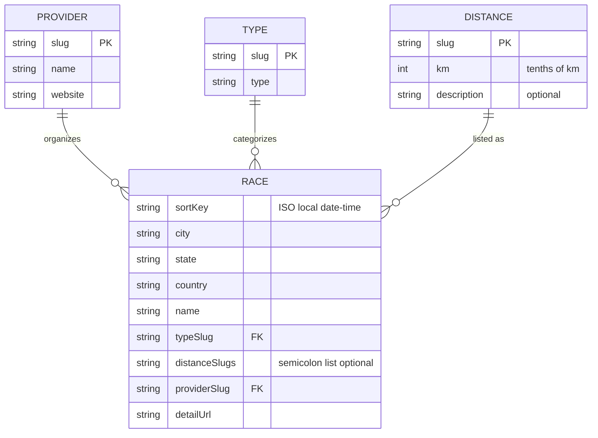

# Data model

RunningCalendar stores normalized race data in CSV files under `src/data/`. The site loads them at build time via `src/data/races.ts`.

Schema validation: run `npm run validate-csv` locally before committing. Slug rules are summarized in [slug-conventions.md](./slug-conventions.md).

## Entity relationship

- **Provider**: Race organizer; linked from the UI by name (website URL).
- **Type**: Kind of event (e.g. road, trail); `races.typeSlug` references `types.slug` (default in data: `road` when omitted in scraper output; the CSV column should still be set for clarity).
- **Distance**: Canonical distance options; `races.distanceSlugs` is a `;`-separated list of `distances.slug`. The `km` column stores **integer tenths of a kilometre** (for example `50` → 5 km, `211` → 21.1 km) so values stay integers while preserving half-marathon precision. Optional `description` holds non-numeric context (for example kids categories) instead of putting prose in the race row.
- **Race**: One scheduled event. `sortKey` is the single source for ordering and display time (ISO `YYYY-MM-DDTHH:MM`). `detailUrl` is the public page for “View details”.

## Column reference

| File | Columns |
|------|---------|
| `races.csv` | `sortKey`, `city`, `state`, `country`, `name`, `typeSlug`, `distanceSlugs` (optional), `providerSlug`, `detailUrl` |
| `providers.csv` | `slug`, `name`, `website` |
| `types.csv` | `slug`, `type` |
| `distances.csv` | `slug`, `km`, `description` (optional) |
