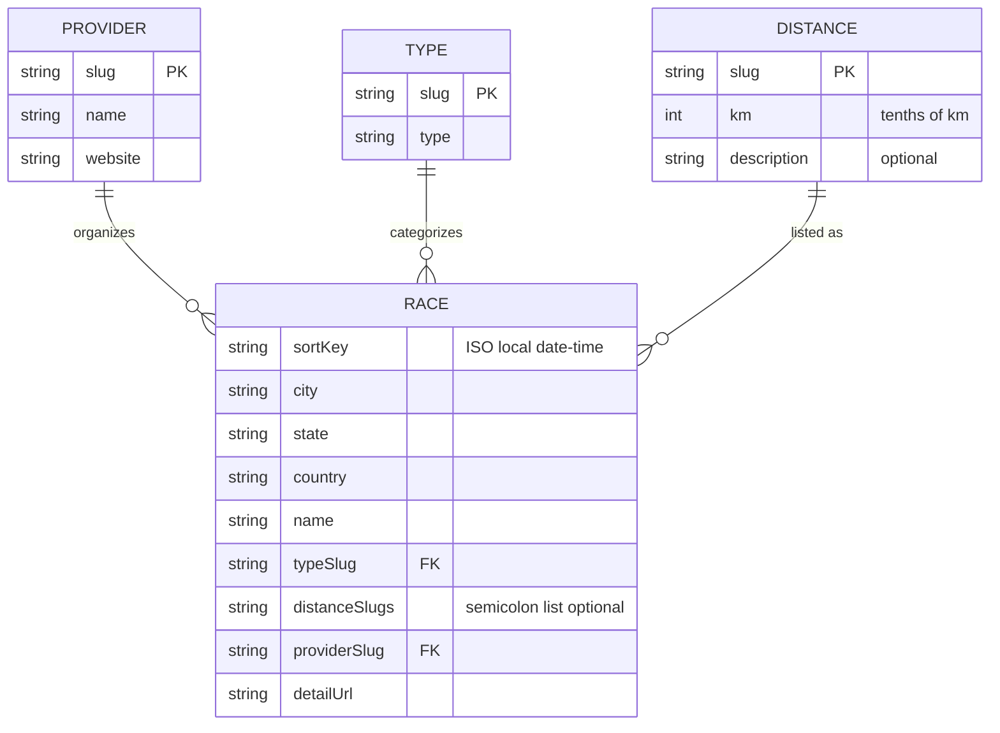
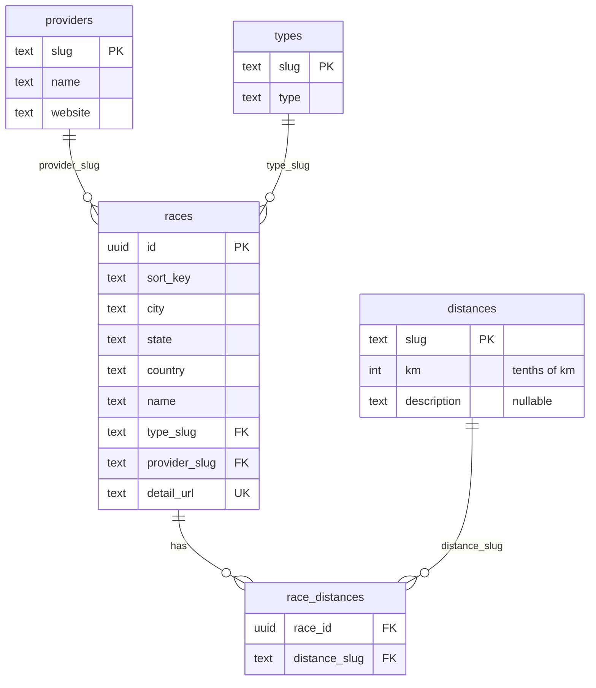

# Data model

RunningCalendar uses the **same conceptual model** in two places:

1. **PostgreSQL on Supabase** — **source of truth for the site**: `src/data/races.ts` calls `loadCalendar()` at **build time** (SSR in Astro) and reads `public.providers`, `public.types`, `public.distances`, `public.races`, and `public.race_distances`. Set **`RUNNINGCALENDAR_DATABASE_URL`**, **`DATABASE_URL`**, or **`SUPABASE_DB_URL`** to the Supabase **session mode** Postgres URI. The browser still receives a static page; there is no client-side DB access.
2. **CSV files** under `src/data/` — **not** used to render pages. They remain for **`npm run validate-csv`**, Python scraper FK checks, and as a human-editable mirror of reference data if you keep them in sync with the database.

Schema validation for CSVs: run `npm run validate-csv` locally before committing. Slug rules are summarized in [slug-conventions.md](./slug-conventions.md).

## Reference CSV shape (scrapers / validation)

These files describe the same entities as the database columns below. They are **not** imported by the Astro app for listing races.

### Entity relationship (CSV)

In the repo, each race stores **multiple distances** as a single optional column: `distanceSlugs` is a `;`-separated list of `distances.slug` values.

- **Provider**: Race organizer; linked from the UI by name (website URL).
- **Type**: Kind of event (e.g. road, trail); `races.typeSlug` references `types.slug` (default in data: `road` when omitted in scraper output; the CSV column should still be set for clarity).
- **Distance**: Canonical distance options; `races.distanceSlugs` is a `;`-separated list of `distances.slug`. The `km` column stores **integer tenths of a kilometre** (for example `50` → 5 km, `211` → 21.1 km) so values stay integers while preserving half-marathon precision. Optional `description` holds non-numeric context (for example kids categories) instead of putting prose in the race row.
- **Race**: One scheduled event. `sortKey` is the single source for ordering and display time (ISO `YYYY-MM-DDTHH:MM`). `detailUrl` is the public page for “View details”. Client-side distance filtering on the home page uses each race’s listed distances (see [components.md](./components.md)).

### Column reference (CSV)

| File | Columns |
|------|---------|
| `races.csv` | `sortKey`, `city`, `state`, `country`, `name`, `typeSlug`, `distanceSlugs` (optional), `providerSlug`, `detailUrl` |
| `providers.csv` | `slug`, `name`, `website` |
| `types.csv` | `slug`, `type` |
| `distances.csv` | `slug`, `km`, `description` (optional) |

## Supabase / PostgreSQL

The database mirrors providers, types, distances, and races, but **splits race–distance associations** into a junction table so the relationship is properly **many-to-many** (`races` ↔ `distances`).

### Entity relationship (database)

- **`races`**: One row per event. `id` is a UUID primary key. **`detail_url` is unique** and matches the CSV `detailUrl`; it is the stable natural key used when seeding and when resolving junction rows.
- **`race_distances`**: One row per (race, distance) pair. Replaces `races.csv`’s `distanceSlugs` list. Races with no distances in the CSV have no rows here.
- **`distances.km`**: Same meaning as in CSV — integer **tenths of a kilometre** (documented in SQL comments on the column).

### Security

Row Level Security (RLS) is enabled on these tables. Policies allow **`anon` and `authenticated` read (`SELECT`) only** — typical for public calendar data consumed from the browser with the anon key.

### CSV ↔ database mapping

| CSV | Database |
|-----|----------|
| `providers.csv` | `public.providers` |
| `types.csv` | `public.types` |
| `distances.csv` | `public.distances` |
| `races.csv` (scalar columns) | `public.races` (`sort_key`, `detail_url`, …) |
| `races.csv` → `distanceSlugs` | `public.race_distances` (one insert per slug after splitting on `;`) |

### Populating the database from CSVs

The repository does **not** ship generated SQL or migration artifacts for bulk loading. To sync Supabase with `src/data/*.csv`, apply the schema (for example migration `running_calendar_schema` on the project) and load data yourself: insert reference rows (`providers`, `types`, `distances`), insert `races` with `detail_url` matching `detailUrl`, then insert `race_distances` rows by splitting each race’s `distanceSlugs` on `;` and joining to `distances.slug`. Split large scripts if your SQL client enforces a payload limit.

### Incremental updates from scrapers (`--save-to`)

From `scrapers/`, `python3 run_scrapers.py run <name> --save-to` connects to PostgreSQL using **`RUNNINGCALENDAR_DATABASE_URL`** or **`DATABASE_URL`** (use the Supabase **session mode** URI from **Project Settings → Database**). It validates scraped rows against `src/data/distances.csv`, `types.csv`, and `providers.csv`, skips races whose normalized `detailUrl` already exists in `public.races`, then inserts new rows into **`public.races`** and **`public.race_distances`**. It does **not** modify `src/data/races.csv`.

**GitHub Pages / CI:** add the same connection string as a repository secret (e.g. `RUNNINGCALENDAR_DATABASE_URL`) and pass it into `npm run build` so prerendering can load the calendar.
