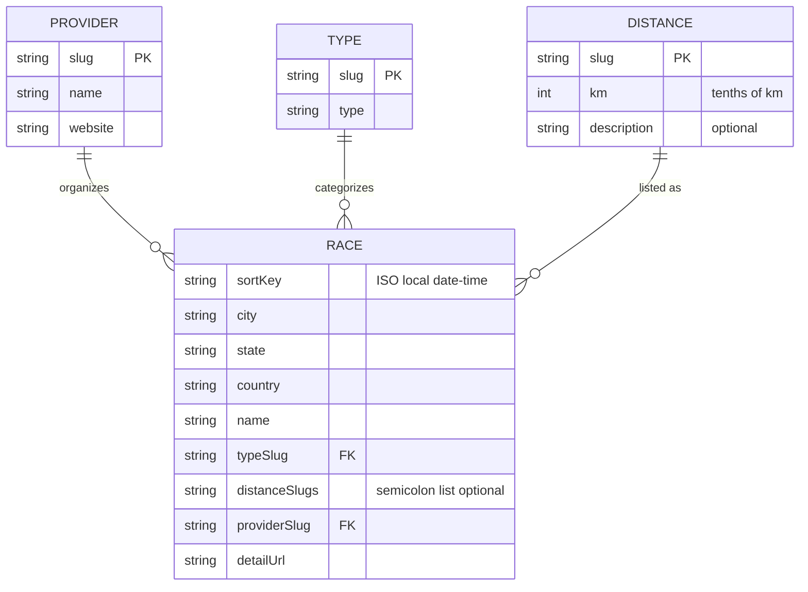
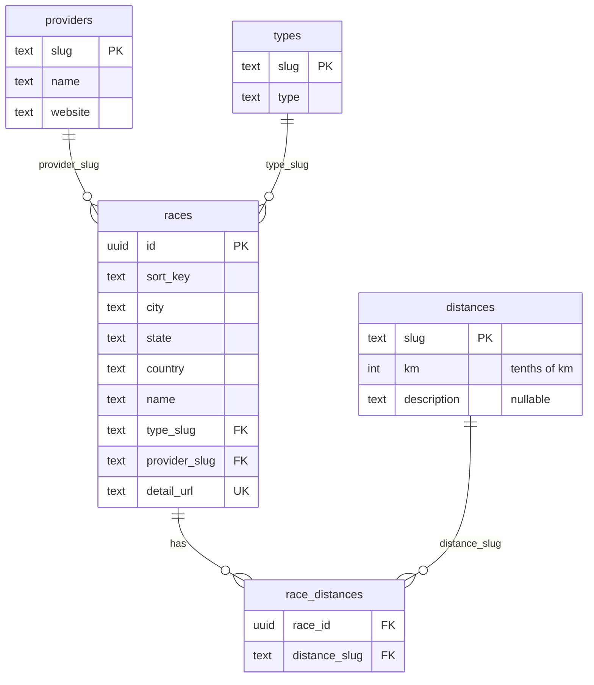

# Data model

**PostgreSQL on Supabase** is the **only source of truth** for calendar data: `apps/site/src/data/races.ts` calls `loadCalendar()` at **build time** (SSR in Astro) and reads `public.providers`, `public.types`, `public.distances`, `public.races`, and `public.race_distances`. Set **`RUNNINGCALENDAR_DATABASE_URL`**, **`DATABASE_URL`**, or **`SUPABASE_DB_URL`** to the Supabase **session mode** Postgres URI. The browser still receives a static page; there is no client-side DB access.

Schema validation: run **`npm run validate-db`** locally (requires the same env vars). Slug rules are summarized in [slug-conventions.md](./slug-conventions.md).

## Scrapers: flat race row shape

Python scrapers still output **CSV-shaped** rows (same column names as before) for stdout and for `--save-to` inserts. Each race lists **multiple distances** as a single optional field: `distanceSlugs` is a `;`-separated list of `distances.slug` values.

- **Provider**: Race organizer; linked from the UI by name (website URL).
- **Type**: Kind of event (e.g. road, trail); `typeSlug` references `types.slug` (default in data: `road` when omitted in scraper output; the field should still be set for clarity).
- **Distance**: Canonical distance options; `distanceSlugs` is a `;`-separated list of `distances.slug`. The `km` column stores **integer tenths of a kilometre** (for example `50` → 5 km, `211` → 21.1 km). Optional `description` holds non-numeric context (for example kids categories).
- **Race**: One scheduled event. `sortKey` is the single source for ordering and display time (ISO `YYYY-MM-DDTHH:MM`). `detailUrl` is the public page for “View details”. Client-side distance filtering on the home page uses each race’s listed distances (see [components.md](./components.md)).

### Column reference (scraper / export row)

| Logical source | Columns |
|----------------|---------|
| Race row | `sortKey`, `city`, `state`, `country`, `name`, `typeSlug`, `distanceSlugs` (optional), `providerSlug`, `detailUrl` |
| Provider | `slug`, `name`, `website` |
| Type | `slug`, `type` |
| Distance | `slug`, `km`, `description` (optional) |

## Supabase / PostgreSQL

The database stores providers, types, distances, and races, and **splits race–distance associations** into a junction table so the relationship is properly **many-to-many** (`races` ↔ `distances`).

### Entity relationship (database)

- **`races`**: One row per event. `id` is a UUID primary key. **`detail_url` is unique**; it is the stable natural key for deduplication and junction resolution.
- **`race_distances`**: One row per (race, distance) pair. Replaces the flat `distanceSlugs` list. Races with no distances have no rows here.
- **`distances.km`**: Integer **tenths of a kilometre** (documented in SQL comments on the column).

### Security

Row Level Security (RLS) is enabled on these tables. Policies allow **`anon` and `authenticated` read (`SELECT`) only** — typical for public calendar data consumed from the browser with the anon key.

### Flat row ↔ database mapping

| Flat / scraper field | Database |
|---------------------|----------|
| Provider row | `public.providers` |
| Type row | `public.types` |
| Distance row | `public.distances` |
| Race scalar fields | `public.races` (`sort_key`, `detail_url`, …) |
| `distanceSlugs` (`;` list) | `public.race_distances` (one row per slug) |

### Loading and maintaining data

Apply your schema on the Supabase project, then load reference rows (`providers`, `types`, `distances`), insert `races` with unique `detail_url`, then insert `race_distances` by splitting each race’s `distanceSlugs` on `;` and joining to `distances.slug`. The repository does not ship bulk-load SQL; split large scripts if your SQL client enforces a payload limit.

### Incremental updates from scrapers (`--save-to`)

From `scrapers/`, `python3 run_scrapers.py run <name> --save-to` connects to PostgreSQL using **`RUNNINGCALENDAR_DATABASE_URL`**, **`DATABASE_URL`**, or **`SUPABASE_DB_URL`** (Supabase **session mode** URI from **Project Settings → Database**). It validates scraped rows against **`public.distances`**, **`public.types`**, and **`public.providers`**, skips races whose normalized `detailUrl` already exists in `public.races`, then inserts new rows into **`public.races`** and **`public.race_distances`**.

**GitHub Pages / CI:** add the same connection string as a repository secret (e.g. `RUNNINGCALENDAR_DATABASE_URL`) and pass it into `npm run build` and `npm run validate-db` so CI can check the live schema.

**Integrity check:** `npm run validate-db` asserts slug formats, URLs, FK references, unique `detail_url`, and orphan-free `race_distances` (same rules as the former CSV validator, against the live database).
