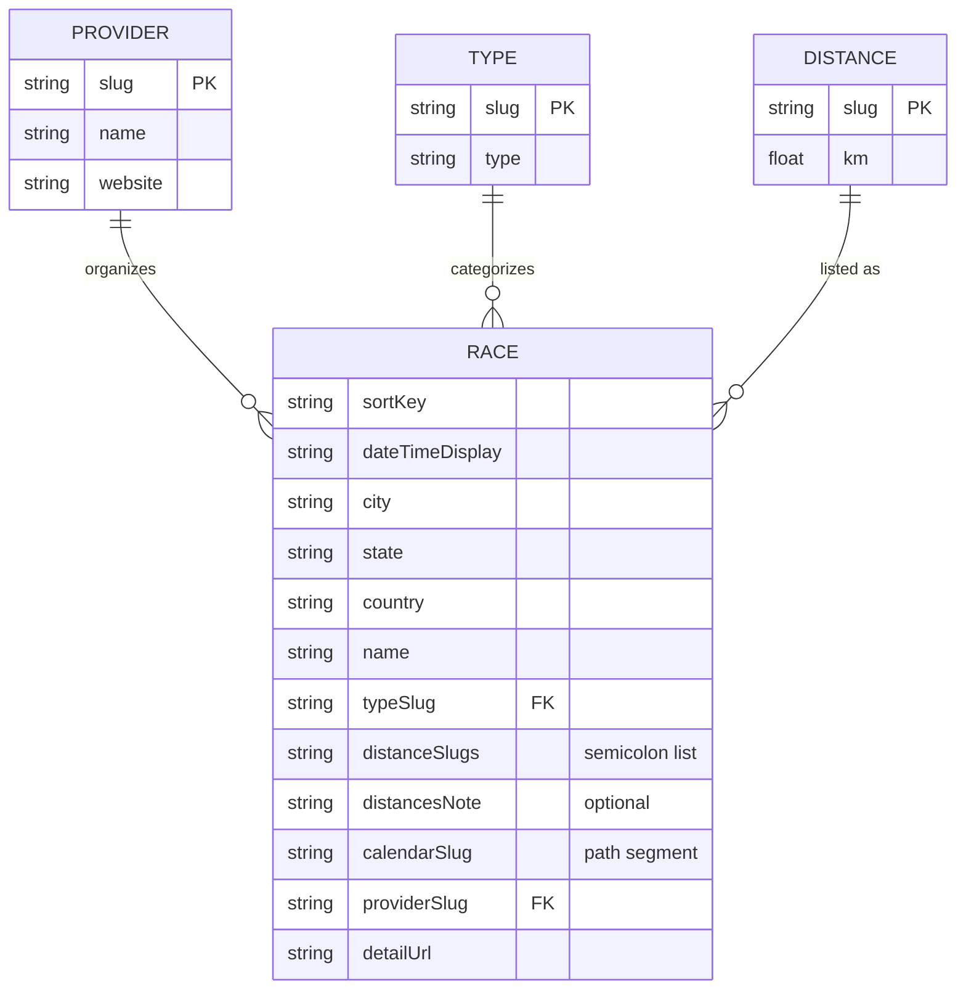

# Data model

RunningCalendar stores normalized race data in CSV files under `src/data/`. The site loads them at build time via `src/data/races.ts`.

## Entity relationship

- **Provider**: Race organizer; linked from the UI by name (website URL).
- **Type**: Kind of event (e.g. road, trail); `races.typeSlug` references `types.slug`.
- **Distance**: Canonical distance options; `races.distanceSlugs` is a `;`-separated list of `distances.slug`. For non-km events (e.g. kids), `distanceSlugs` may be empty and `distancesNote` holds the explanation.
- **Race**: One scheduled event. `calendarSlug` is the site-specific path segment used for stable IDs (e.g. Iguana blog slug). `detailUrl` is the public page for “View details”.
