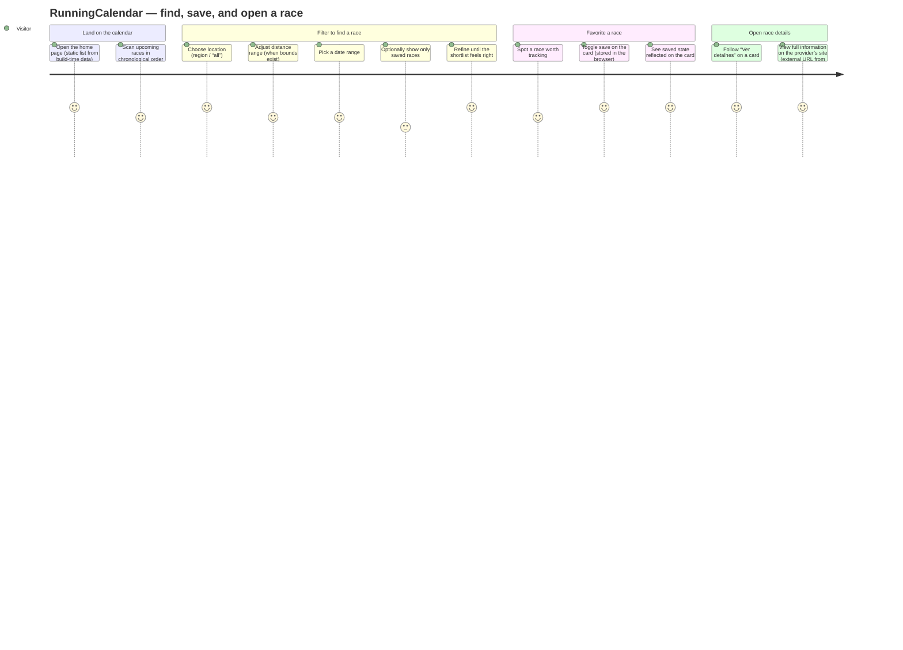

# User journey

This page describes the main path someone takes on the **calendar home page**: narrow the list, mark races to revisit, and open the organizer’s page for full details. The UI copy on the site is largely **Portuguese**; this doc uses English for maintainability.

## Primary journey

## What each step maps to

- **Filters** — Location select, distance slider, date range, and “Somente corridas salvas” work together; all run client-side on the rendered list (`src/pages/index.astro` and related Svelte components).
- **Save / favorite** — The heart control on each card persists **saved race ids** (the race’s `detailUrl`) in **local storage**; see `src/lib/savedRaces.ts` and `SaveRaceButton`.
- **Details** — There is no in-app detail route; **Ver detalhes** links to the canonical **`detailUrl`** from the database (`raceUrl()` in `src/data/races.ts`).

For schema and build-time data flow, see [data-model.md](./data-model.md).
